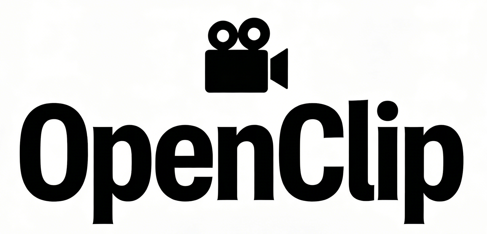

<p align="center">
  
</p>


[English](./README_EN.md) | 简体中文

一个轻量化自动化视频处理流水线，用于识别和提取长视频（特别是口播和直播回放）中最精彩的片段。使用 AI 驱动的分析来发现亮点，生成剪辑，并添加标题和封面。

## 🎯 功能介绍

输入一个视频 URL 或本地文件，自动完成 **下载 → 转录 → 分割 → AI 分析 → 剪辑生成 → 添加标题和封面** 的全流程处理，输出最精彩片段。适合从长直播或视频中快速提取高光时刻。

> 💡 **与 AutoClip 的区别？** 查看[对比说明](#-与-autoclip-的对比)了解 OpenClip 的轻量级设计理念。

## 📢 最新动态

- **2026-04-23**:
  - 新增后处理 `Clip Editor`：可对单个片段进行边界、字幕、封面标题与封面图的二次调整，并支持倍速重渲染
  - Streamlit 新增浏览器内 `文件上传` 入口，可直接上传本地视频并创建处理任务；支持[局域网/共享机器模式](#lan-shared-machine-mode)
- **2026-04-19**:
  - 新增 `--deep-optimize` / Streamlit「深度优化」模式：在候选片段汇总后增加一轮更深入的 AI 检查与边界修正，以提升片段边界质量和独立成段效果，详见[开启 `--deep-optimize` 时](#开启---deep-optimize-时)
- **2026-04-04**:
  - 新增 `custom_openai` 提供商，可在 Streamlit 或 CLI 中自定义 `LLM Model` 与 `LLM Base URL`，对接本地或自建 OpenAI 兼容接口
  - 新增 [Paraformer 中文 ASR 支持](#paraformer-installation)，本地 ASR 会自动按语言路由，中文优先使用 Paraformer
- **2026-03-30**:
  - 新增默认开启的剪辑边界修正，目标是让高光片段的开始和结束更自然，减少突兀截断
  - 在 Streamlit UI 中支持 Bilibili 多 P 视频一键创建任务、后台任务重试，以及重启后取消 pending 任务，感谢 [@xenoamess](https://github.com/xenoamess)
- **2026-03-25**:
  - 新增 [Cookie 使用建议](#cookie-guidance) 与更清晰的 Streamlit `Cookie 模式`；远程视频下载可按 `不使用 cookies` → `浏览器 cookies` → `Cookies 文件` 的顺序尝试
<details>
<summary>更早的更新</summary>

- **2026-03-24**:
  - 新增 [GLM（智谱AI）](https://bigmodel.cn) 和 [MiniMax](https://minimaxi.com) 作为 LLM 提供商，现支持 Qwen、OpenRouter、GLM、MiniMax 与 `custom_openai`
- **2026-03-11**:
  - OpenClip 现已上架 skills.sh，可通过 `npx skills add https://github.com/linzzzzzz/openclip --skill video-clip-extractor` 在任意目录安装为 Agent Skill，并让 Agent 调用
- **2026-03-08**:
  - 新增 `--user-intent` 参数 — 用自然语言告诉 AI 你在找什么（如 `--user-intent "关于 AI 风险的观点"`），LLM 在片段筛选和排名时会优先考虑相关内容
- **2026-03-04**:
  - **Git 历史变更通知**：错误的减小 GitHub size 的尝试导致 Git 历史被重写，对现有用户造成不便，深感抱歉。已有克隆用户需运行 `git fetch origin && git reset --hard origin/main` 以同步最新历史
  - 新增[字幕烧录功能](#subtitle-burning) — 使用 `--burn-subtitles` 将 SRT 字幕直接烧录到剪辑视频中；可选 `--subtitle-translation "Simplified Chinese"` 同时烧录中英双语字幕（需要带 libass 的 ffmpeg）
  - OpenRouter 默认模型从 openrouter/free 切换至 stepfun/step-3.5-flash:free
- **2026-03-01**:
  - Streamlit 界面支持[后台任务处理和并发处理多个视频](#concurrent-processing)
  - 新增[说话人识别功能（预览版）](#speaker-identification)— 使用 `--speaker-references` 为访谈/座谈/播客视频自动标注说话人姓名
  - 优化 AI 提示词，减少时间戳格式混淆（如 `00:01:55` vs `01:55:00`）
- **2025-02-26**:
  - 默认 Qwen 模型从旧版 qwen-turbo 切换至 qwen3.5-flash
  - 优化 AI 提示词，减少时间戳幻觉，提升标题质量

</details>

## 🎬 演示

### 网页页面


### Agent Skills

<video src="https://github.com/user-attachments/assets/1ddf8318-f6ad-418c-9c4c-bbac0dedc668" controls width="600" height="450"></video>

## ✨ 特性
- **灵活输入**：支持 Bilibili、YouTube URL 或本地视频文件
- **智能转录**：优先使用平台字幕；本地 ASR 会自动按语言路由，英文使用 Whisper，中文使用 Paraformer
- **说话人识别**（预览版）：自动识别谁在说话，将真实姓名标注到字幕中，适合访谈、座谈、辩论和播客
- **AI 分析**：基于内容、互动和娱乐价值识别精彩时刻；支持 `--user-intent` 引导 AI 聚焦特定关注点
- **剪辑生成**：提取最精彩时刻为独立视频剪辑，自动生成字幕文件、标题和封面图片
- **字幕烧录**（可选）：将 SRT 字幕硬烧到视频画面中，可选通过当前选定的 LLM 提供商翻译成目标语言后烧录双语字幕
- **背景上下文**：可选的添加背景信息（如主播姓名等）以获得更好的分析
- **三界面支持**：Streamlit 网页界面，Agent Skills 和命令行界面，满足不同用户需求
- **Agent Skills**：内置 [Claude Code](https://docs.anthropic.com/en/docs/claude-code) 和 [TRAE](https://www.trae.ai/) agent skill，用自然语言即可处理视频

## 📋 前置要求

### 手动安装

- **uv**（Python 包管理器）- [安装指南](https://docs.astral.sh/uv/getting-started/installation/)
- **FFmpeg** - 用于视频处理
  - macOS: `brew install ffmpeg`
  - Ubuntu: `sudo apt install ffmpeg`
  - Windows: 从 [ffmpeg.org](https://ffmpeg.org) 下载

  <details>
  <summary>需要双语字幕烧录？点击查看带 libass 的安装方式</summary>

  默认安装通常不包含 libass：
  - macOS: `brew tap homebrew-ffmpeg/ffmpeg && brew install homebrew-ffmpeg/ffmpeg/ffmpeg`（替换已有的 ffmpeg）
  - Ubuntu: `sudo add-apt-repository ppa:savoury1/ffmpeg4 && sudo apt install ffmpeg`
  - Windows: 从 [gyan.dev](https://www.gyan.dev/ffmpeg/builds/) 下载 **full** 版本
  </details>

- **LLM API Key / 接口配置**（选择其一）
  - **Qwen API Key** - 从[阿里云](https://dashscope.aliyun.com/)获取密钥（默认使用 qwen3.5-flash 模型）
  - **OpenRouter API Key** - 从[OpenRouter](https://openrouter.ai/)获取密钥（默认使用 stepfun/step-3.5-flash:free 模型）
  - **GLM API Key** - 从[智谱AI](https://open.bigmodel.cn/)获取密钥（默认使用 glm-4.7 模型）
  - **MiniMax API Key** - 从[MiniMax](https://platform.minimaxi.com/)获取密钥（默认使用 MiniMax-M2.7 模型）
  - **Custom OpenAI 兼容接口** - 需要可访问的 OpenAI-compatible chat completions 接口；需配置 `CUSTOM_OPENAI_BASE_URL` 和 `CUSTOM_OPENAI_MODEL`，`CUSTOM_OPENAI_API_KEY` 可选

- **Chrome / Firefox / Edge / Safari 浏览器**（可选）- 当你选择使用浏览器 Cookie 时，可用于远程视频下载身份验证
- **Deno 或 Node**（可选，YouTube 下载可能会需要）- 提升 YouTube 下载稳定性。OpenClip 会自动检测并使用；如果你主要处理 YouTube，尤其是需要 cookies 的情况，建议安装
  - 安装方式可参考 yt-dlp 官方 EJS 文档：
    [Step 1: Install a supported JavaScript runtime](https://github.com/yt-dlp/yt-dlp/wiki/EJS#step-1-install-a-supported-javascript-runtime)
- **HuggingFace Token** (可选，用于说话人识别) - 从 [huggingface.co/settings/tokens](https://huggingface.co/settings/tokens) 获取，并接受 [pyannote 模型协议](https://huggingface.co/pyannote/speaker-diarization-community-1)

### 由 uv 自动管理

运行 `uv sync` 时会自动安装以下依赖：

- **Python 3.11+** - 如果系统未安装，uv 会自动下载
- **yt-dlp** - 用于从 Bilibili、YouTube 等平台下载视频
- **Whisper** - 用于语音转文字
- 其他 Python 依赖（moviepy、streamlit 等）

可选 extra：

- `uv sync --extra paraformer` - 安装 Paraformer 中文本地 ASR 运行时依赖
- `uv sync --extra speakers` - 安装 WhisperX 说话人识别依赖

## 🚀 快速开始

### 1. 克隆和设置

```bash
# 克隆仓库
git clone https://github.com/linzzzzzz/openclip.git
cd openclip

# 使用 uv 安装依赖
uv sync
```

<a id="paraformer-installation"></a>
<details>
<summary>🈶 启用 Paraformer 中文本地 ASR（可选）</summary>

如果你希望在本地 ASR 路径里优先使用 Paraformer 处理中文音频，请额外完成下面两步：

```bash
# 1) 安装 Paraformer 运行时依赖
uv sync --extra paraformer
```

```bash
# 2) 准备兼容的 Paraformer helper checkout
# 默认目录：
third_party/funasr-paraformer
```

推荐直接把 helper 仓库 checkout 到当前项目内，避免把开发机绝对路径写进配置：

```bash
mkdir -p third_party
git clone <funasr-paraformer-helper-repo> third_party/funasr-paraformer
```

OpenClip 当前会在这个 helper 目录里查找两个脚本：

- `tools/transcribe_long_audio.py`
- `tools/funasr_json_to_srt.py`

如果你的 helper 项目不在默认目录，可以设置：

```bash
export PARAFORMER_PROJECT_DIR=/path/to/funasr-paraformer
```

说明：

- 默认路径已经是仓库相对路径：`third_party/funasr-paraformer`
- 如果 helper 项目自带 `.venv`，OpenClip 会优先使用它
- 如果 helper 项目没有 `.venv`，OpenClip 会退回使用当前仓库通过 `uv sync --extra paraformer` 安装出来的环境
- 如果 helper 项目或依赖不可用，OpenClip 会自动回退到 Whisper

</details>

### 2. 设置 API 密钥（用于 AI 功能）

根据你选择的 LLM 提供商，设置对应的环境变量（至少配置一组）：

```bash
export QWEN_API_KEY=your_api_key_here        # 通义千问
export OPENROUTER_API_KEY=your_api_key_here   # OpenRouter
export GLM_API_KEY=your_api_key_here          # 智谱AI GLM (bigmodel.cn 国内端点)
export MINIMAX_API_KEY=your_api_key_here      # MiniMax (minimaxi.com 国内端点)
export CUSTOM_OPENAI_API_KEY=your_api_key_here # custom_openai，可选
export CUSTOM_OPENAI_BASE_URL=http://127.0.0.1:8000/v1
export CUSTOM_OPENAI_MODEL=Qwen/Qwen2.5-7B-Instruct
```

说明：

- `custom_openai` 适合对接 LM Studio、vLLM、One API、New API 等 OpenAI 兼容服务
- `CUSTOM_OPENAI_BASE_URL` 可以是 API 根路径（如 `.../v1`），也可以直接写完整的 `/chat/completions` 接口
- 如果你的兼容接口不要求 Bearer 鉴权，`CUSTOM_OPENAI_API_KEY` 可以留空
- Streamlit 侧边栏支持按提供商覆盖 `LLM Model` 和 `LLM Base URL`；CLI 对应参数为 `--llm-model` 和 `--llm-base-url`

### 3. 运行流水线

#### 选项 A：使用 Streamlit 网页界面

**启动 Streamlit 应用：**
```bash
uv run python -m streamlit run streamlit_app.py
```

应用启动后，打开浏览器访问显示的 URL（通常是 `http://localhost:8501`）。

<a id="lan-shared-machine-mode"></a>
<details>
<summary>局域网/共享机器模式</summary>

如果需要从同一局域网内的其他设备访问 Streamlit，并让「Open in Editor」显示可访问的 Clip Editor 链接：

```bash
export OPENCLIP_EDITOR_BASE_URL=http://HOST_LAN_IP:8765
# 可选：显式指定编辑器服务监听地址与端口
export OPENCLIP_EDITOR_HOST=0.0.0.0
export OPENCLIP_EDITOR_PORT=8765

uv run python -m streamlit run streamlit_app.py --server.address 0.0.0.0 --server.port 8501
```

可用以下命令查看 Mac 主机的局域网 IP：

```bash
ipconfig getifaddr en0
```

在另一台同网设备上打开 `http://HOST_LAN_IP:8501`。Clip Editor 项目地址形如 `http://HOST_LAN_IP:8765/projects/PROJECT_ID`。

在局域网模式下，「Open in Editor」会在 Streamlit 中显示「Open Clip Editor」链接，而不会在服务器机器上自动打开浏览器标签页。如果链接无法打开，请确认两台设备在同一网络，并允许防火墙访问 `8501` 和 `8765` 端口。

</details>

**使用流程：**
1. 在侧边栏选择输入类型（视频 URL 或本地文件）
2. 配置处理选项（LLM 提供商、`LLM Model`、`LLM Base URL`、Cookie 模式等）
3. 点击「Process Video」按钮开始处理
4. 查看实时进度和最终结果
5. 在结果区域预览生成的剪辑和封面

如果选择 `custom_openai`，请在侧边栏填写 `LLM Model` 和 `LLM Base URL`；如果你的接口不需要鉴权，API Key 可以留空。

**优势：** 无需记住命令行参数，提供可视化操作界面，适合所有用户。

<a id="concurrent-processing"></a>
<details>
<summary>🔄 并发处理与后台任务</summary>

Streamlit 界面支持后台任务处理和并发处理多个视频：

**后台任务处理：**
- 视频处理在后台运行，可以关闭浏览器
- 任务持久化保存，重新打开页面可继续查看
- 每个任务独立运行，互不干扰

**并发处理多个视频：**
- 点击「处理视频」启动第一个任务 → 自动跟踪进度
- **打开新标签页**启动第二个任务 → 在新标签页中独立跟踪
- 每个标签页可独立跟踪不同任务

**Watch Progress 功能：**
- 在任务卡片中点击「👁️ Watch Progress」按钮可切换跟踪的任务
- 显示「✓ Watching」表示当前正在跟踪该任务
- 实时查看进度更新和当前处理步骤

**任务管理：**
- 查看所有任务状态（处理中、已完成、失败）
- 取消运行中的任务
- 删除已完成或失败的任务
- 查看任务详情（创建时间、处理时长等）

</details>

#### 选项 B：使用 AI Agent 技能

如果你使用 [Claude Code](https://docs.anthropic.com/en/docs/claude-code)、[TRAE](https://www.trae.ai/)、Cursor 或任何其他支持 skills 的 Agent，可以直接用自然语言处理视频，无需手动输入命令：

```
"帮我从这个视频里提取精彩片段：https://www.bilibili.com/video/BV1234567890"
"处理一下 ~/Downloads/livestream.mp4，用英语作为输出语言"
```

Agent 会自动完成环境配置、下载、转录、分析、剪辑和标题添加等全部流程。

**选择安装方式：**

| 场景 | 操作 |
|------|------|
| 已克隆本仓库 | 无需操作 — 在仓库目录内打开 Agent 时技能自动生效 |
| 全局使用（任意目录、任意项目均可触发） | 在任意目录执行：`npx skills add https://github.com/linzzzzzz/openclip --skill video-clip-extractor -g` |
| 仅在某个特定项目目录内使用 | 在该目录下执行：`npx skills add https://github.com/linzzzzzz/openclip --skill video-clip-extractor` |

技能定义位于 `.claude/skills/video-clip-extractor/` 目录下。

#### 选项 C：使用命令行界面

```bash
# 处理 Bilibili 视频
uv run python video_orchestrator.py "https://www.bilibili.com/video/BV1234567890"

# 处理 YouTube 视频
uv run python video_orchestrator.py "https://www.youtube.com/watch?v=dQw4w9WgXcQ"

# 处理本地视频
uv run python video_orchestrator.py "/path/to/video.mp4"
```

> 如需使用已有字幕，请将 `.srt` 文件放在同目录下，文件名保持一致（如 `video.mp4` → `video.srt`）。

<a id="speaker-identification"></a>
<details>
<summary>🎙️ 说话人识别（可选，预览版）</summary>

> ⚠️ **预览功能**：说话人识别功能目前处于预览阶段，后续版本中行为或接口可能有所调整。
>
> 🐢 **性能提示**：说话人识别依赖 pyannote 模型，在 CPU 上运行较慢（长视频可能需要数分钟）。有 GPU 环境下速度会显著提升。

适用于访谈、座谈、辩论、播客等多人对话视频。启用后，字幕中每句话前会标注说话人姓名，例如 `[Host] 欢迎来到今天的节目`。这为 AI 的高光分析提供了更丰富的上下文——让它能更准确地识别特定说话人之间最精彩的交流片段，而非将所有语音一视同仁。

**步骤一：安装额外依赖**

```bash
uv sync --extra speakers
```

**步骤二：设置 HuggingFace Token**

```bash
export HUGGINGFACE_TOKEN=hf_your_token_here
```

并在 HuggingFace 上接受 [pyannote 模型协议](https://huggingface.co/pyannote/speaker-diarization-community-1)。

**步骤三：提取参考音频**

从视频中截取每位说话人的参考片段（10–30 秒，单人清晰语音）：

```bash
uv run python tools/extract_reference.py VIDEO 起始时间 结束时间 "references/姓名.wav"

# 示例
uv run python tools/extract_reference.py interview.mp4 00:01:23 00:01:50 "references/Host.wav"
uv run python tools/extract_reference.py interview.mp4 00:03:10 00:03:40 "references/Guest.wav"
```

**步骤四：运行**

```bash
uv run python video_orchestrator.py --speaker-references references/ "VIDEO_URL_OR_PATH"
```

</details>

<a id="subtitle-burning"></a>
<details>
<summary>🔤 字幕烧录（可选）</summary>

将 SRT 字幕文件硬烧到视频画面中（即使没有字幕播放器也能看到字幕）。支持原始字幕烧录，或通过当前选定的 LLM 提供商翻译后同时烧录双语字幕。说话人标签（如 `[Sam Altman]`）会自动从画面中移除。

**前提：ffmpeg 需包含 libass**（详见上方安装说明）

**仅烧录原始字幕：**
```bash
uv run python video_orchestrator.py --burn-subtitles "VIDEO_URL"
```

**烧录原始 + 中文翻译字幕：**
```bash
uv run python video_orchestrator.py \
  --burn-subtitles \
  --subtitle-translation "Simplified Chinese" \
  "VIDEO_URL"
```

输出文件在 `clips_post_processed/` 目录，英文字幕显示在底部，中文字幕显示在英文上方。

</details>

<a id="cookie-guidance"></a>
## 🍪 Cookie 使用建议

远程视频下载有时会遇到登录验证、风控或平台限制。OpenClip 支持三种模式：

- `不使用 cookies`：先尝试最简单的公开访问方式
- `浏览器 cookies`：使用本机浏览器中的登录态
- `Cookies 文件`：使用导出的 Netscape 格式 `cookies.txt`

**推荐尝试顺序：**

1. 先试 `不使用 cookies`
2. 如果报登录、风控、`not a bot`、`LOGIN_REQUIRED` 等错误，再试 `浏览器 cookies`
3. 如果浏览器 cookies 仍不稳定，再试 `Cookies 文件`

**YouTube 特别说明：**

- 对于 YouTube，如果你使用 cookies，则很可能还需要安装 Deno 或 Node 这样的 JavaScript 运行时，否则可能只拿到不完整格式，甚至下载失败。安装说明可见[前置要求](#-前置要求)

**CLI 对应方式：**

1. 不传任何 cookie 参数
2. 使用 `--browser chrome`（或你实际使用的浏览器）
3. 使用 `--cookies /path/to/cookies.txt`

**注意：**

- 仅在确实需要登录态访问内容时再使用 cookies，并尽量控制下载频率，或使用备用账号

**导出 Cookies 文件：**

- 如果你需要生成 `cookies.txt`，可参考 yt-dlp 官方教程：
  [Exporting YouTube cookies](https://github.com/yt-dlp/yt-dlp/wiki/Extractors#exporting-youtube-cookies)
- 虽然教程标题写的是 YouTube，但在 OpenClip 中，导出的 Netscape 格式 `cookies.txt` 同样可用于 YouTube 和 Bilibili

## 📖 命令行参数

| 参数 | 说明 | 默认值 |
|------|------|--------|
| `VIDEO_URL_OR_PATH` | 视频 URL 或本地文件路径（位置参数） | 必填 |
| `-o`, `--output` | 自定义输出目录 | `processed_videos` |
| `--llm-provider` | LLM 提供商（`qwen`、`openrouter`、`glm`、`minimax` 或 `custom_openai`） | `qwen` |
| `--llm-model` | 覆盖当前提供商使用的模型名；对 `custom_openai` 通常需要显式配置 | 提供商默认值 |
| `--llm-base-url` | 覆盖当前提供商使用的 OpenAI 兼容 chat completions 地址；对 `custom_openai` 通常需要显式配置 | 提供商默认值 |
| `--language` | 输出语言（`zh` 或 `en`） | `zh` |
| `--browser` | 用于 cookie 的浏览器（`chrome`/`firefox`/`edge`/`safari`）；仅在显式提供时使用 | 无 |
| `--cookies` | Netscape 格式 `cookies.txt` 文件路径；提供后优先于 `--browser` | 无 |
| `--js-runtime` | 仅用于 YouTube 下载的 JavaScript 运行时策略（`auto`/`deno`/`node`/`none`） | `auto` |
| `--js-runtime-path` | 仅用于 YouTube 下载的 JavaScript 运行时可执行文件路径（高级选项） | 无 |
| `--force-whisper` | 强制使用本地 ASR 转录（忽略平台字幕）；英文使用 Whisper，中文使用 Paraformer | 关 |
| `--use-background` | 使用背景信息辅助分析 | 关 |
| `--normalize-boundaries` / `--no-normalize-boundaries` | 剪辑生成时将开始/结束时间对齐到附近字幕边界；优先句子边界，其次字幕间停顿。默认开启，可用 `--no-normalize-boundaries` 关闭 | 开 |
| `--deep-optimize` | 启用更深入的片段复审与优化流程，提升片段边界和独立成段质量，但处理更慢。详见[开启 `--deep-optimize` 时](#开启---deep-optimize-时) | 关 |
| `--user-intent` | 用自然语言描述关注重点（如 `"关于 AI 风险的观点"`），引导 AI 优先选取相关片段 | 无 |
| `--max-clips` | 最大精彩片段数量 | `5` |
| `--title-style` | Banner 标题艺术风格（见下方列表） | `fire_flame` |
| `--title-font-size` | 艺术标题字体大小（可选：small=30px, medium=40px, large=50px, xlarge=60px，默认：medium=40px） | `medium` |
| `--cover-text-location` | 封面文字位置（`top`/`upper_middle`/`bottom`/`center`） | `center` |
| `--cover-fill-color` | 封面文字填充颜色（`yellow`/`red`/`white`/`cyan`/`green`/`orange`/`pink`/`purple`/`gold`/`silver`） | `yellow` |
| `--cover-outline-color` | 封面文字描边颜色（`yellow`/`red`/`white`/`cyan`/`green`/`orange`/`pink`/`purple`/`gold`/`silver`/`black`） | `black` |
| `--speaker-references` | 参考音频目录，用于说话人姓名映射（预览版）。文件名即说话人姓名（如 `references/Host.wav`）。需要 `uv sync --extra speakers` 和 `HUGGINGFACE_TOKEN` | 无 |
| `--skip-transcript` | 跳过转录生成（使用已有转录文件） | 关 |
| `--skip-download` | 跳过下载，使用已下载的视频 | 关 |
| `--skip-analysis` | 跳过分析，使用已有分析结果 | 关 |
| `--skip-clips` | 不生成剪辑 | 关 |
| `--add-titles` | 添加艺术标题到剪辑 | 关 |
| `--skip-cover` | 不生成封面图片 | 关 |
| `--burn-subtitles` | 将 SRT 字幕烧录到视频中，输出到 `clips_post_processed/`（需要带 libass 的 ffmpeg） | 关 |
| `--subtitle-translation` | 翻译字幕到指定语言后烧录（例如 `"Simplified Chinese"`），需同时开启 `--burn-subtitles` | 无 |
| `-f`, `--filename` | 自定义输出文件名模板 | 无 |
| `-v`, `--verbose` | 开启详细日志 | 关 |
| `--debug` | 开启调试模式（导出完整 LLM 提示词） | 关 |

<details>
<summary>🎨 Banner 标题艺术风格</summary>

| 风格 | 效果 |
|------|------|
| `fire_flame` | 火焰效果（默认） |
| `gradient_3d` | 渐变3D效果 |
| `neon_glow` | 霓虹发光效果 |
| `metallic_gold` | 金属金色效果 |
| `rainbow_3d` | 彩虹3D效果 |
| `crystal_ice` | 水晶冰效果 |
| `metallic_silver` | 金属银色效果 |
| `glowing_plasma` | 发光等离子效果 |
| `stone_carved` | 石刻效果 |
| `glass_transparent` | 玻璃透明效果 |

</details>

## 🔍 命令行示例

**处理 Bilibili 视频，加载背景信息， 并使用霓虹风格处理Banner标题：**
```bash
uv run python video_orchestrator.py \
  --title-style neon_glow \
  --use-background \
  "https://www.bilibili.com/video/BV1wT6GBBEPp"
```

**仅分析，不生成剪辑：**
```bash
uv run python video_orchestrator.py --skip-clips --skip-cover "VIDEO_URL"
```

**说话人识别（预览版）：**
```bash
uv run python video_orchestrator.py \
  --speaker-references references/ \
  "interview.mp4"
```

**跳过下载，重新处理已有视频：**
```bash
uv run python video_orchestrator.py --skip-download --title-style crystal_ice "VIDEO_URL"
```

**使用自定义 OpenAI 兼容接口：**
```bash
uv run python video_orchestrator.py \
  --llm-provider custom_openai \
  --llm-model Qwen/Qwen2.5-7B-Instruct \
  --llm-base-url http://127.0.0.1:8000/v1 \
  "VIDEO_URL"
```

## 📁 输出结构

处理后，输出目录结构如下：

```
processed_videos/{video_name}/
├── downloads/                # 原始视频、字幕和元数据
├── splits/                   # 分割片段和 AI 分析结果
├── clips/                    # 生成的精彩剪辑、字幕、摘要和封面图
│   ├── rank_01_xxx.mp4
│   ├── rank_01_xxx.srt
│   ├── engaging_moments_summary.md
│   └── cover_rank_01_xxx.jpg
└── clips_post_processed/     # 后处理剪辑（--add-titles 和/或 --burn-subtitles）
    ├── rank_01_xxx.mp4
    └── ...
```

## 🎨 自定义

### 添加背景信息

创建或编辑 `prompts/background/background.md` 以提供关于主播、昵称或重复主题的上下文：

```markdown
# 背景信息

## 主播信息
- 主播：旭旭宝宝
- 昵称：宝哥
- 游戏：地下城与勇士（DNF）

## 常用术语
- 增幅：装备强化
- 鉴定：物品鉴定
```

然后使用 `--use-background` 标志：
```bash
uv run python video_orchestrator.py --use-background "VIDEO_URL"
```

### 自定义分析提示词

编辑 `prompts/` 中的提示词模板：
- `engaging_moments_part_requirement.md` - 每个片段的分析标准
- `engaging_moments_agg_requirement.md` - 顶级时刻的汇总标准

### 用自然语言指定关注点

你也可以通过 `--user-intent` 告诉 OpenClip 你更想要哪类片段，例如：

- `关于 AI 风险的观点`
- `最有争议的争论片段`
- `适合短视频传播的高能时刻`

这不会强制只输出某一类内容，但会影响候选片段的优先级与最终排序。

## 🔧 工作流程

OpenClip 会先找到候选高光片段，再生成字幕、剪辑、封面和可选后期处理。默认模式更快；开启 `--deep-optimize` 后，会增加额外的 AI 复审与边界优化流程，以换取更高的片段质量。

### 默认流程

```text
输入（URL 或文件）
    ↓
下载/验证视频
    ↓
提取/生成转录
    ↓
检查时长 → 如果 >20 分钟则分割
    ↓
AI 分析（每个片段）
    ↓
汇总候选高光
    ↓
生成剪辑
    ↓
后期处理（可选）
  ├── 添加艺术标题 (--add-titles)
  └── 烧录字幕 (--burn-subtitles [--subtitle-translation LANG])
    ↓
生成封面图片
    ↓
输出完成
```

### 开启 `--deep-optimize` 时

在默认流程的“汇总候选高光”之后，会增加额外的 AI 复审阶段：

- 判断每个候选片段是否能独立成段
- 必要时尝试修复片段边界
- 对修复后的片段再次复审
- 再进入最终片段筛选与导出

```text
默认流程
汇总候选高光
   ↓
生成剪辑

开启 --deep-optimize 后
汇总候选高光
   ↓
judge（独立成段复审）
   ↓
repair（必要时修复边界）
   ↓
rejudge（修复后复审）
   ↓
生成剪辑
```

这样通常能得到边界更自然、上下文更完整、更适合直接传播的片段。

### 代价与适用场景

- 代价是处理时间和 token 用量都会增加
- 以 60 分钟左右的视频为例，额外耗时通常约 **3 到 6 分钟**；token 用量的增幅取决于候选片段数量，以及是否触发修复与复审
- 如果更看重片段质量，建议开启
- 如果更看重速度和成本，可以保持关闭

## 📎 其他

<details>
<summary>🐛 故障排除</summary>

### 下载失败
**原因**：
- yt-dlp 版本过旧。YouTube 变化较快，建议更新依赖版本：`uv lock --upgrade-package yt-dlp && uv sync`。
- Cookie / 身份验证问题。Streamlit 中可将 `Cookie 模式` 切换为 `浏览器 cookies` 或 `Cookies 文件`；CLI 可使用 `--browser chrome` 或 `--cookies /path/to/cookies.txt`。
- YouTube 报 `Sign in to confirm you're not a bot` 或 `LOGIN_REQUIRED`。这通常表示当前请求需要 cookies 才能继续下载。
- YouTube 只显示图片格式或报 `Requested format is not available`。OpenClip 会自动尝试 `deno` / `node` 作为 JS 运行时；如果仍失败，请安装其中之一，或用 `--js-runtime node --js-runtime-path /path/to/node` 显式指定。

### 未生成剪辑
**原因**：缺少 LLM 凭据 / 接口配置或分析失败。检查 `echo $QWEN_API_KEY`、`echo $OPENROUTER_API_KEY`、`echo $GLM_API_KEY`、`echo $MINIMAX_API_KEY`，或确认 `CUSTOM_OPENAI_BASE_URL` / `CUSTOM_OPENAI_MODEL` 已设置，并确认分析文件存在。

### FFmpeg 错误
**原因**：FFmpeg 未安装或不在 PATH 中。运行 `ffmpeg -version` 检查，缺失则安装（macOS: `brew install ffmpeg`）。

### 内存问题
**原因**：视频过长。尝试 `--max-duration 10` 缩短分割时长，或不使用 `--add-titles` 分阶段处理。

### 说话人识别不工作

**未找到 WhisperX**：运行 `uv sync --extra speakers` 安装额外依赖。

**HuggingFace Token 错误**：检查 `echo $HUGGINGFACE_TOKEN` 是否已设置，并确认已在 HuggingFace 上接受 [pyannote 模型协议](https://huggingface.co/pyannote/speaker-diarization-community-1)。

**说话人未被识别（显示 SPEAKER_XX 而非姓名）**：参考音频相似度低于阈值（默认 0.7）。尝试使用更长、更清晰的参考片段（推荐 10–30 秒），确保片段中只有一位说话人。

### 中文文本不显示
**原因**：缺少中文字体。OpenClip 会自动检测 macOS（STHeiti、PingFang）、Windows（宋体、微软雅黑）以及 Linux 上常见的 Noto / WenQuanYi / Source Han 字体；如果都找不到，会直接提示缺少字体而不是继续生成异常文字。Linux 可安装 `fonts-noto-cjk`、`fonts-wqy-zenhei` 或 `adobe-source-han-sans-otc-fonts`。

</details>

## 🔄 与 AutoClip 的对比

OpenClip 受 [AutoClip](https://github.com/zhouxiaoka/autoclip) 启发，但采用不同设计理念：

| 特性 | OpenClip | AutoClip |
|------|----------|----------|
| **代码规模** | ~5K 行 | ~2M 行 (含前端依赖) |
| **依赖** | Python + FFmpeg | Docker + Redis + PostgreSQL + Celery |
| **定制性** | 可编辑提示词模板 | 配置文件 |
| **界面** | Web界面+Agent Skills+命令行 | Web界面 |
| **部署** | `uv sync` 即用 | Docker容器化 |

**OpenClip 特点：** 轻量（5K行代码）、快速启动、提示词可定制、易于维护和二次开发

感谢 [AutoClip](https://github.com/zhouxiaoka/autoclip) 为视频自动化处理做出的贡献。

## 🤝 贡献

欢迎PRs！我们希望尽可能保持codebase的轻量化以及可读性：

**改进方向**
- 改进的 AI 分析提示词
- 性能优化
- 多模态分析
- 支持更多视频平台
- 额外的语言支持

## 📞 支持

如有问题或疑问：
1. 查看控制台输出中的错误消息
2. 先用短视频测试
3. 在 GitHub 上提出 issue
4. 加入我们的 [Discord 社区](https://discord.gg/KsC4Keaq) 讨论交流

## ⭐ 喜欢这个项目？

如果这个项目对你有帮助，欢迎在 GitHub 上给我们一个 Star！⭐

你的支持是我们持续改进的动力！

## 📄 许可证

本项目采用 MIT 许可证 - 详见 [LICENSE](LICENSE) 文件
